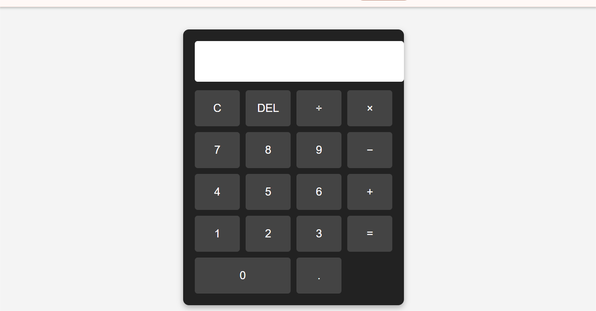
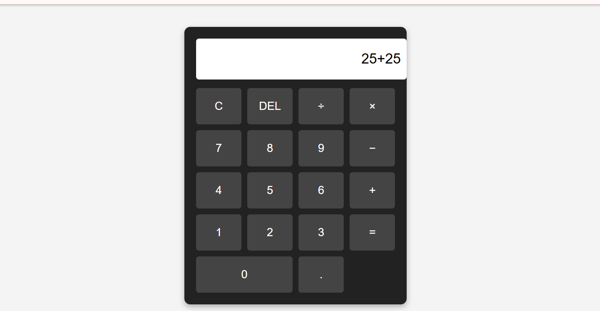

# WebDev-L2-Calculator

A simple web‑based calculator that performs basic arithmetic operations (addition, subtraction, multiplication, division) using **HTML, CSS, and JavaScript**. Built as part of Oasis Infobyte Level 2 Internship tasks.

---

## 🧮 Features
- Perform addition, subtraction, multiplication, division
- Clear button to reset input
- Responsive design (works on desktop & mobile)
- Error handling for invalid inputs

---

## 🛠️ Technologies Used
- HTML5
- CSS3
- JavaScript
- Google Fonts (for styling)
- Font Awesome (for icons)

---

## 🚀 How to Run
1. Clone or download this repository.
2. Open the folder (`WebDev-L2-Calculator`).
3. Double‑click `index.html` or open it in any modern browser.
4. Start calculating instantly — no installation required.  
   *(Tested on Chrome, Edge, and Firefox)*

---

## 📸 Screenshots
  
*Basic calculator interface*

  
*Performing a calculation*

---

## 🌐 Live Demo
[View on GitHub Pages](https://poojitha-jakkartha.github.io/WebDev-L2-Calculator)

---

## 🔮 Future Improvements
- Add scientific functions (square root, power, etc.)
- Dark mode toggle
- Keyboard input support
